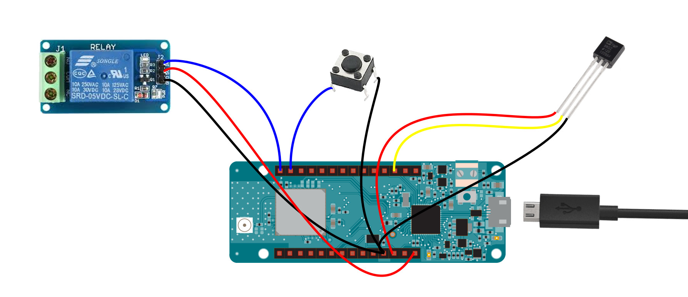

# Termostat amb Arduino MKR WAN 1300

Exemple de comunicació bidireccional sobre TTN amb un Arduino MKR WAN 1300.

[](LICENSE)
[](https://travis-ci.org/ttncat/termostat)
[](https://twitter.com/intent/follow?screen_name=ttncat)

Aquest exemple fa servir la llibreria MKRWAN d'Arduino,
disponible des del gestor de llibreries de l'IDE o aquí:
https://github.com/arduino-libraries/MKRWAN

## Hardware

#### Components

* Arduino MKRWAN1300 amb mòdul LoRaWan Murata CMWX1ZZABZ (http://tinkerman.cat/arduino-mkr-wan-1300/)
* Sensor de temperatura analògic TMP35/LM35
* Mòdul de relé
* Botó
* Cables i/o protoboard per fer les connexions

#### Cablejat



## Configuració del *backend* de TTN

#### Configuració bàsica

Crea un nou aplicatiu i un dispositiu en aquest aplicatiu. Selecciona ABP o OTTA i anota les claus generades. Les hauràs d'incloure a l'arxiu `credentials.h` del codi més endavant.

#### Payload parsing

Selecciona la pestanya `Payload Formats` dins de l'aplicatiu i introdueix el següent codi per el `decoder`:

```

function Decoder(bytes, port) {
    var decoded = {};
    if (12 == port) {
        var value = (bytes[0] - 100) + (bytes[1] / 100);
        decoded.temperature = value;
        decoded.relay = (0x31 == bytes[2]);
    }
    return decoded;
}
```

Aquest codi és l'encarregat de parsejar el missatge de manera que el nostre aplicatiu el rebi en forma de paràmetres.

## Firmware Arduino

Primer de tot cal carregar a l'IDE d'Arduino el suport per plaques SAMD21 i la llibreria MKRWAN. Es pot fer des de les opcions 'Gestor de targes' i 'Gestor de llibreries'. Aquest pas no és necessari si es fa servir PlatformIO.

Pot ser necessari actualitzar el firmware del STM32 que hi ha dins el mòdul LoRa de Murata. Afortunadament la llibreria MKRWAN bé amb un sketch d'exemple específic per fer això. Només cal que carreguis al MKRWAN1300 l'exemple `MKRWANFWUpdate_standalone`. Un cop fet ober el monitor del port sèrie per veure el procés d'actualització. Quan hagi acabat el mòdul ja estarà preparat per carregar el nostre propip sketch.

El primer que cal fer és configurar les dades per connectar-nos a TTN. Duplica l'arxiu `credentials.sample.h` amb el nom `credentials.h` i edita'l introduint-hi les dades apropiades segons el *backend* the TTN.

Després compila i puja el codi al MKR WAN 1300. Ho pots fer fent servir PlatformIO amb `pio run -t upload` o amb l'IDE d'Arduino.

Per defecte el codi envia un missatge amb la temperatura i l'estat del relé cada 60 segons i espera resposta per canviar l'estat del relé. També es pot forçar l'enviament prement el botó.

Tots els paràmetres de configuració (temps entre missatges, GPIOs dels diferents components...) estan al principi del codi principal (thermostat.ino).

## Aplicatiu Node-RED

La carpeta `node-red` conté un fluxe que gestiona els missatges entrants, aplica la lògica d'un termostat i envia (si cal) un missatge al node amb un canvi d'estat en el relé.

#### Requeriments

El fluxe de Node-RED necessita els següents components: `node-red-contrib-ttn` i `node-red-dashboard`. Es poden instal·lar fent servir la opció `Manage Palette` del menú superior dret de l'interficie de Node-RED.

#### Fluxe

Obre l'arxiu `flow.json` amb un editor de text i copia els continguts. Després fes servir la opció `Import > Clipboard` del menú superior dret de Node-RED per copiar el fluxe a la pestanya actual.


Obre qualsevol dels nodes TTN (ttn-uplink) i al costat del nom de l'aplicatiu clica a l'eina d'edició. En el formulari que apareixerà hauràs de canviar el AppID amb el Application ID de la teva aplicació i l'Access Key amb un amb permissos per missatges i esdeveniments.

Un cop fet això hauries de començar a rebre missatges del node. Visita la pàgina del dashboard (normalment la mateixa URL de Node-RED + "/ui") per veure la temperatura, canviar el mode d'us del relay (ON, OFF or AUTO) o seleccionar el rang de temperatures per el mode AUTO.


## Llicència

Copyright (C) 2018 by Xose Pérez (@xoseperez)
for The Things Network Catalunya

This program is free software: you can redistribute it and/or modify
it under the terms of the GNU General Public License as published by
the Free Software Foundation, either version 3 of the License, or
(at your option) any later version.

This program is distributed in the hope that it will be useful,
but WITHOUT ANY WARRANTY; without even the implied warranty of
MERCHANTABILITY or FITNESS FOR A PARTICULAR PURPOSE.  See the
GNU General Public License for more details.

You should have received a copy of the GNU General Public License
along with this program.  If not, see <http://www.gnu.org/licenses/>.
